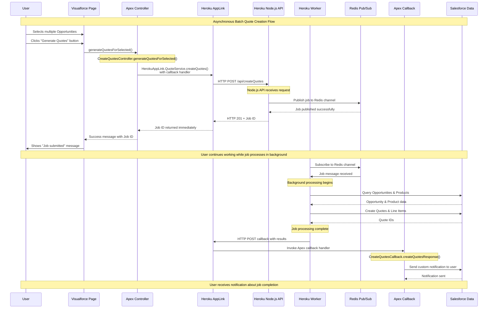

# VF → Apex → Heroku → Apex → VF Sequence Diagram

This diagram shows the asynchronous flow for creating multiple quotes using Heroku AppLink with callbacks.

## Key Points

1. **Asynchronous Flow**: Job is submitted and user continues working
2. **Background Processing**: Heavy work happens in Heroku worker process
3. **Callback Pattern**: Apex callback handler receives results when job completes
4. **User Context**: Callback runs with original user's permissions
5. **Redis Pub/Sub**: Handles job queuing and worker coordination
6. **Immediate Response**: User gets job ID and can continue working

## Components Involved

- **VF**: `CreateQuotes` page with list view button
- **Apex**: `CreateQuotesController` and `CreateQuotesCallback`
- **Heroku**: Node.js API + Worker process
- **Redis**: Message broker for job queuing
- **AppLink**: Handles callback routing back to Apex
- **Notification**: Custom notification sent to user upon completion

## Benefits of This Pattern

1. **Non-blocking**: User doesn't wait for long-running operations
2. **Scalable**: Multiple workers can process jobs in parallel
3. **Reliable**: Redis ensures job delivery and worker coordination
4. **User-friendly**: Immediate feedback and completion notifications
5. **Maintains Context**: All operations preserve user permissions and identity
