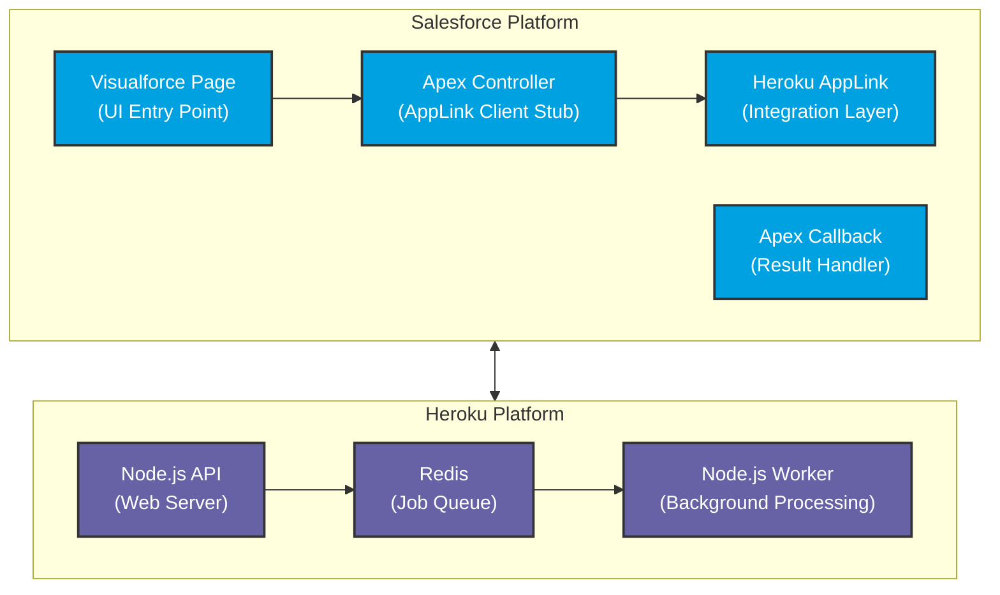

# Quote Generation Architecture Layer Diagram (Asynchronous)

This diagram shows the two main platform layers and their components for the asynchronous quote generation service.

## Platform Responsibilities

### Salesforce Platform
- **Visualforce Page**: User interface for initiating quote generation
- **Apex Controller**: Client stub that calls AppLink service with callback handler
- **AppLink**: Integration layer providing authentication and service discovery
- **Apex Callback**: Result handler that receives completion notifications from Heroku

### Heroku Platform
- **Node.js API**: Web server handling synchronous requests and job queuing
- **Node.js Worker**: Background processing for asynchronous quote generation
- **Redis**: Message broker for job queuing and worker coordination

## Data Flow
1. User initiates quote generation via Visualforce Page
2. Visualforce Page calls Apex Controller
3. Apex Controller calls AppLink service with callback handler
4. AppLink routes request to Heroku API
5. API queues job in Redis for background processing
6. Worker generates quotes and calls back to Apex Callback with results
7. User receives notification with quote completion confirmation
