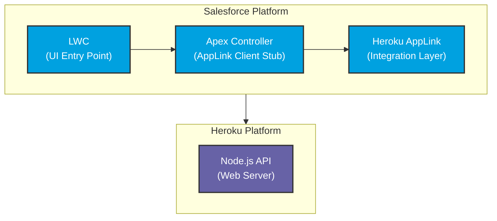

# Quote Generation Architecture Layer Diagram (Synchronous)

This diagram shows the two main platform layers and their components for the synchronous quote generation service.

## Platform Responsibilities

### Salesforce Platform
- **LWC**: User interface for initiating quote generation
- **Apex Controller**: Client stub that calls AppLink service
- **AppLink**: Integration layer providing authentication and service discovery

### Heroku Platform
- **Node.js API**: Web server handling synchronous quote generation requests

## Data Flow (Synchronous)
1. User initiates quote generation via LWC
2. LWC calls Apex Controller
3. Apex Controller calls AppLink service
4. AppLink routes request to Heroku API
5. API generates quotes directly and returns results
6. User receives immediate response with quote confirmation
