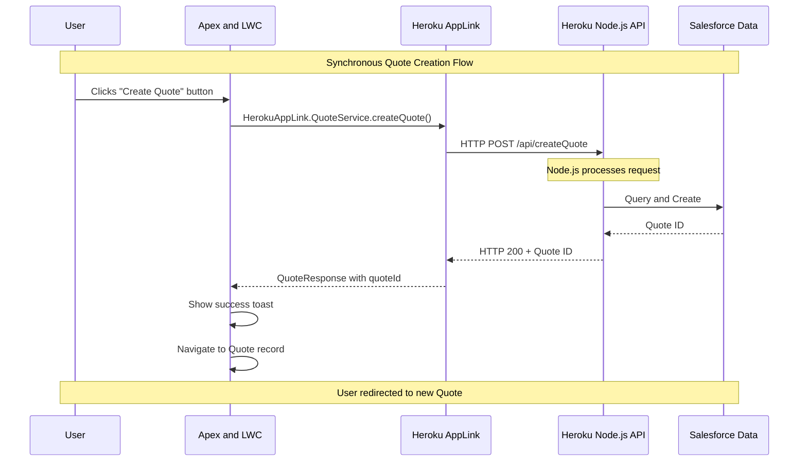

# Simplified LWC → Apex → Heroku → Apex → LWC Sequence Diagram

This diagram shows the simplified synchronous flow for creating a single quote using Heroku AppLink.

## Key Points

1. **Synchronous Flow**: The entire process completes before returning control to the user
2. **User Context**: Maintains user permissions and context throughout the flow
3. **Single Transaction**: Quote creation happens in one atomic operation
4. **Direct Response**: User gets immediate feedback and navigation
5. **No Background Processing**: All work completes within the 120-second callout limit

## Components Involved

- **Apex and LWC**: Combined participant showing the integrated flow
- **Heroku**: Node.js API with AppLink SDK for Salesforce data access
- **AppLink**: Seamless integration layer between Salesforce and Heroku
- **Salesforce Data**: Simplified interaction showing "Query and Create"

## Changes Made

- **Combined LWC and Apex** into single participant "Apex and LWC"
- **Removed yellow note box** "CreateQuoteController.createQuote()"
- **Simplified Heroku to Salesforce** interaction to single "Query and Create" step
- **Cleaner, more focused** diagram showing the essential flow
